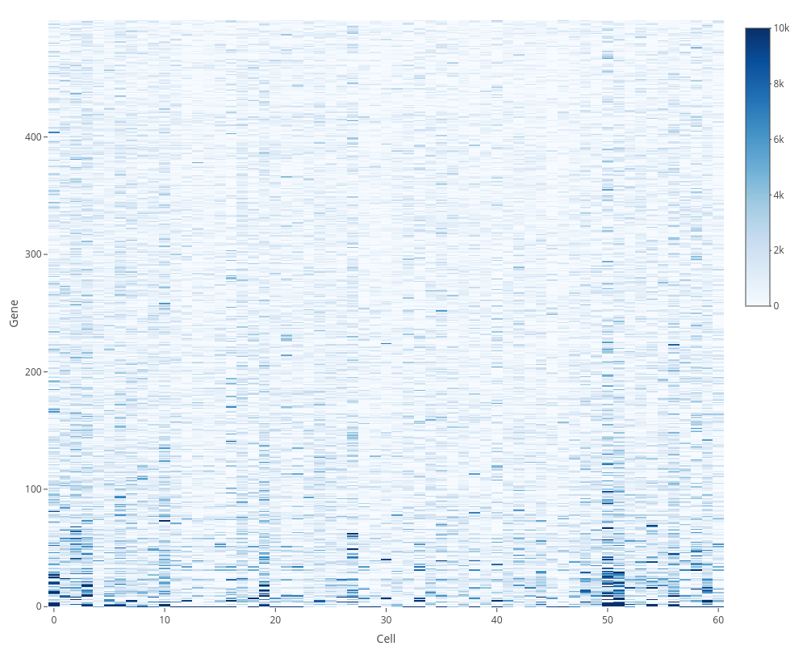
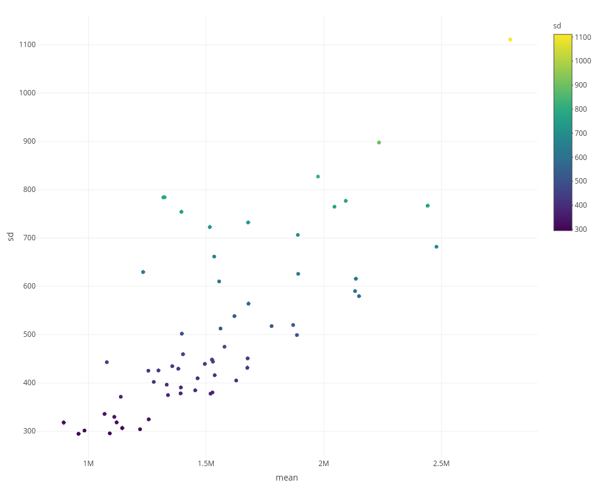
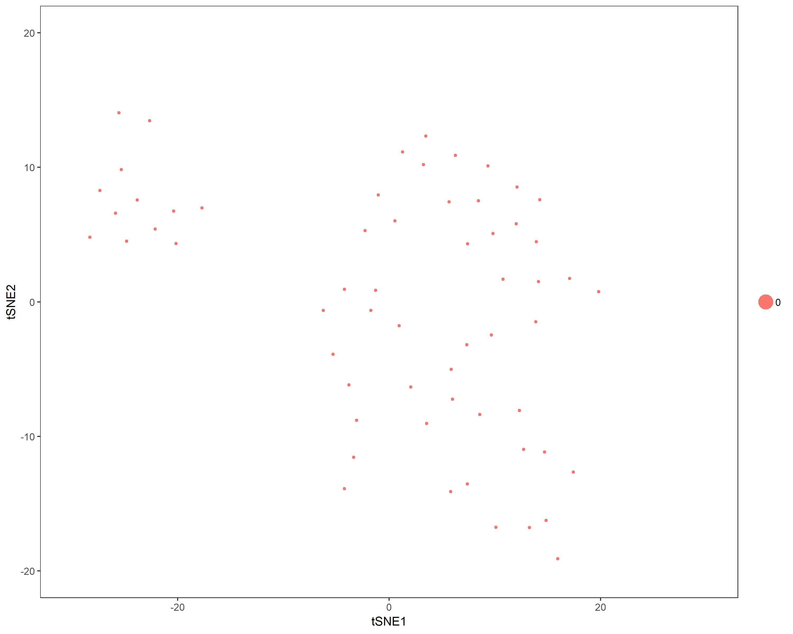
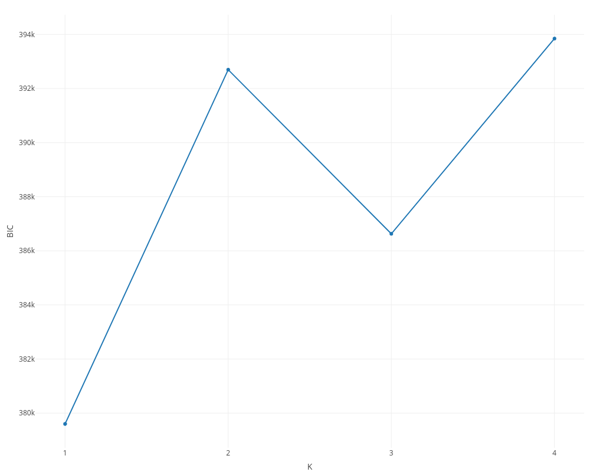
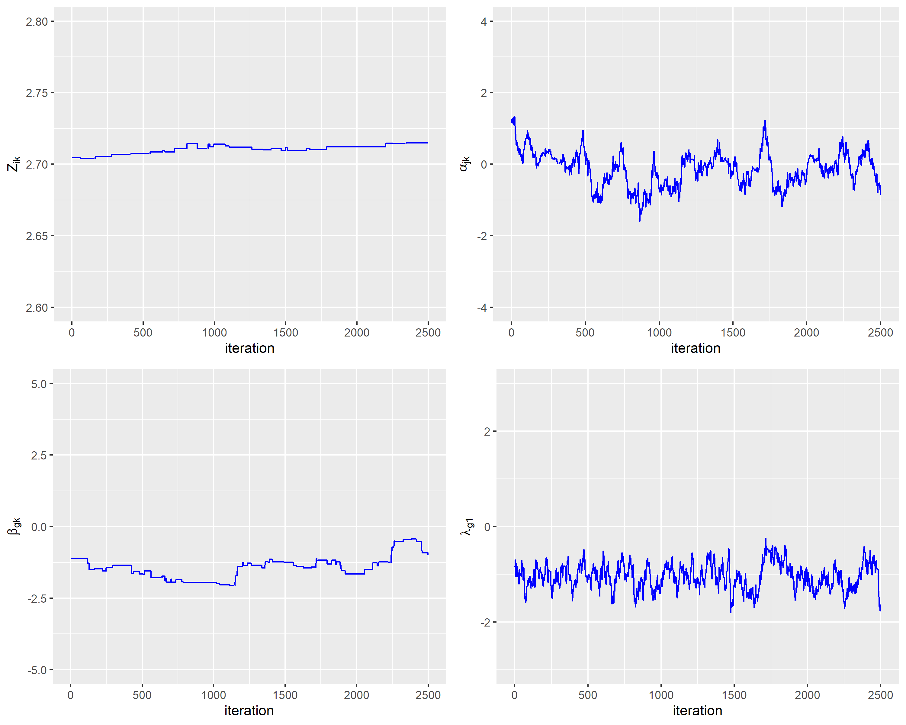
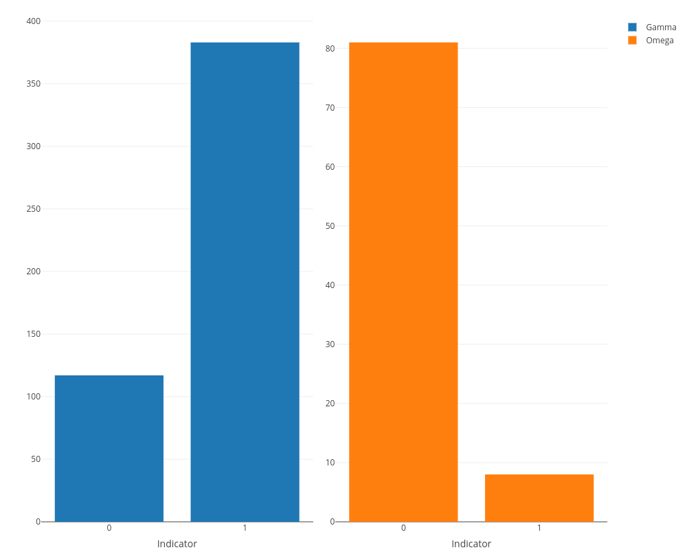
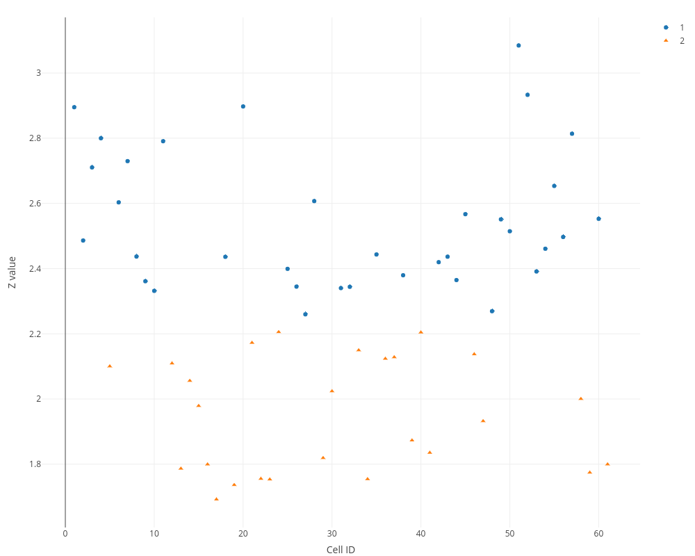

```{r setup, include=FALSE}
knitr::opts_chunk$set(echo = TRUE, eval = TRUE, warning=FALSE)
```
# Introduction
The recent advances in molecular biology, microfluidics and nanotechnology open a new avenue for the precision medicine. The key to the precison treatment is discovering the heterogeneity at the cellular level. The maturation of single-cell sequencing technologies provides unique opportunities for us to detect the characteristics of individual cell. Single-cell RNA sequencing (scRNA-seq) is one of the most widely used single-cell sequencing approaches. Although scRNA-seq technologies have yielded transformative insights into cellular diversity and development, they also limit the ability to derive a deep understanding of the relationships between biomolecules in single cells. The analysis of scRNA-seq data in conjunction with other data types contributes to study cells from multiple perspectives. 

In this project, finding a clustering method to detect the heterogeneity between single cells and integrating scRNA-seq and DNA methylation data to make clustering more accurate are the core. DNA methylation data is a good complemet to scRNA-seq data since methylation in the vicinity of the promoter is associated with the absence of transcription. Angermueller, C. et al. performed parallel DNA methylome and transcriptome sequencing in the same cell and examines the relationships between DNA methylation and gene expression. Linker, S. M. et al. applied parallel DNA methylation and transcriptome sequencing to differentiate human induced pluripotent stem cells. Mo, Qianxing, et al. used a fully Bayesian method to model continuous and discrete omics data. But there is no efficient method which integrates multi-data for analysis.

We have developed a Bayesian integrative clustering method which takes the count nature, over-dispersion and zero-inflated effects of data into account. The new model is a valuable tool for multi-data analysis. We organize this article as follows. In Section 2, we provide details for the model. In Section 3, we show that the model can reveal meaningful subtypes by analyzing serum embryonic stem cells (ESCs) data. In Section 4, we summarize this article with a brief discussion.

# Model
Suppose that both the scRNA-seq and DNA methylation data are collected for $N$ cells in some tissue. The RNA expression levels for $G$ genes and methylated counts for $J$ covered cytosine positions are measured in each cell. We denote by $X_{gi}$ and $M_{ji}$ the read count mapped to gene $g$ and position $j$ in cell $i$, respectively. The core idea of the integrative clustering framework is to reduce the multi-high dimensional space to a low dimensional subspace that will collectively capture the major variations of the multiple genomic data sets. Therefore, the low-dimensional subspace can be used to cluster the cell samples. We assume a low-dimensional integrated subspace $\mathbf{Z}$ with dimension $N \times K$, where there are $K+1$ subtypes of cell samples. In other words, each sample is associated with a latent variable $\mathbf{z}_i = (z_{i1}, \cdots, z_{ik}), (i = 1, \cdots, N)$. 

For DNA methylation data, we model the data with the Poisson model
$$M_{ji} \sim \operatorname{Poisson}(e^{\mathbf{z}^*_i \Omega_j \alpha_j}), (i = 1, \cdots, N, j = 1, \cdots, J) ,$$
where $\alpha_j = \left( \alpha_{0j} , \alpha_{1j} , \cdots, \alpha_{Kj} \right)^{T}$ is the coefficient vector associated with the $j$ th possion; $\mathbf{z}^*_i = \left( 1 , \mathbf{z}_{i} \right) = \left(1 ,z_{i1}, \cdots, z_{ik} \right)$, is a vector in which the first component is 1 and the remaining components are exactly from vector $\mathbf{z}_{i}$; $\Omega_j = \operatorname {diag} \left(1 , \omega_j , \cdots , \omega_j \right)$ is a diagonal matrix whose first diagonal component is 1 and all the remaining $K$ diagonal components are $\omega_j$. In the model, $\omega_j$ is an indicator variable with value 0 or 1, which is used for Bayesian variable selection. When $\omega_j = 0$, it indicates that the corresponding $\alpha_j$ is small and thus the $j$ th possion contributes little for the joint clustering. Otherwise, the corresponding $\alpha_j$ is large and thus the $j$ th possion is a contributor for the joint clustering.

For scRNA-seq data, we take zero-inflated effects into consideration with the following model
$$Y_{gi} \sim \operatorname{Poisson}(e^{\mathbf{z}^*_i \Gamma_g \beta_g}), (i = 1, \cdots, N, g = 1, \cdots, G) ,$$
$$X_{gi} = \left\{ \begin{array} { l l } { 0 } & { \text { with probability } p(Y_{gi}) } \\ 
{Y_{gi}} & { \text { with probability } 1 - p(Y_{gi}) } \end{array} \right. ,$$
where $\beta_g = \left( \beta_{0g} , \beta_{1g} , \cdots, \beta_{Kg} \right)^{T}$ is the coefficient vector associated with the $g$ th gene; $\Gamma_g = \operatorname {diag} \left(1 , \gamma_g , \cdots , \gamma_g \right)$ is a diagonal matrix whose first diagonal component is 1 and all the remaining $K$ diagonal components are $\gamma_g$, which is an indicator variable with value 0 or 1; $Y_{gi}$ is the latent variable of the true read count mapped to gene $g$ in cell $i$; $p(Y_{gi})$ is the dropout rate defined as $\Phi \left(\lambda_{g0} + \lambda_{g1} log_2(Y_{gi}+1) \right)$, where $\Phi(·)$ is the cumulative distribution function of the standard normal distribution. The negative $\lambda _ {g1}$ controls the intensity of becoming zero and is associated with gene $g$. Because $p(Y_{gi})$ is a decreasing function, the larger the $Y_{gi},$ the less likely that we observe a zero for $X_{gi}$.

To perform Bayesian analysis,we assume the following prior distributions for the model parameters
$$\mathbf{z}_i \stackrel{i.i.d.} { \sim } \mathrm{ MVN } \left( \mathbf{z}_{0} ,\Sigma_{\mathbf{z}} \right), (i = 1, \cdots, N), $$
where $\mathbf{z}_i$ follows a multivariate normal distribution.
$$ \alpha_j \stackrel{i.i.d.} { \sim } \mathrm{ MVN } \left( \alpha_{0} , \Sigma_{\alpha} \right), \omega_j \stackrel{i.i.d.} { \sim } \operatorname{Bernoulli}(q_\omega), (j = 1, \cdots, J),$$
$$\beta_g \stackrel{i.i.d.} { \sim } \mathrm{ MVN } \left( \beta_{0} , \Sigma_{\beta} \right), \gamma_g \stackrel{i.i.d.} { \sim } \operatorname{Bernoulli}( q_\gamma), \lambda_{g0} \stackrel{i.i.d.} { \sim } \mathrm{N}(\lambda_{0}, \sigma^2_0), \lambda_{g1} \stackrel{i.i.d.} { \sim } \mathrm{N}(\lambda_{1}, \sigma^2_1), (g = 1, \cdots, G).$$

Given the priors, we utilize the blocked Gibbs sampler to carry out the posterior sampling. In each iteration, the sampling scheme proceeds as follows. ("-" means given all other variables) 

1. Sample the missing variable $Y_{gi}$ for which its observation $X_{gi}$ equals zero from 
$$ p(Y_{gi}| - ) \propto \begin{cases} 
\frac{ e^{\mathbf{z}^*_i \Gamma_g \beta_g Y_{gi}}}{Y_{gi}!} \Phi \left(\lambda_{g0} + \lambda_{g1} log_2(Y_{gi}+1) \right),  & \mbox{if }Y_{gi} > 0 \\
\frac{ e^{\mathbf{z}^*_i \Gamma_g \beta_g Y_{gi}}}{Y_{gi}!} , & \mbox{if }Y_{gi} = 0
\end{cases},$$
where $\Phi(\dot)$ is the cumulative distribution function of the standard normal distribution.
2. Update the coefficient vector $\alpha_j$ associated with the $j$ th position from
$$p( \alpha_j | - ) \propto \left( \prod_{i=1}^N \left( \exp ( \mathbf{z}^*_i \Omega_j \alpha_j) \right) ^ {M_{ji}} \exp \left( - \exp ( \mathbf{z}^*_i \Omega_j \alpha_j) \right) \right) \exp \left( - \frac{1}{2} \left( \alpha_j - \alpha_{0} \right) ^ { T } \Sigma_{\alpha}^{-1} \left( \alpha_j - \alpha_{0} \right) \right).$$
3. Update the indicator variable $\omega_j$ associated with the $j$ th position from
$$p( \omega_j | - ) \propto \left( \prod_{i=1}^N \left( \exp ( \mathbf{z}^*_i \Omega_j \alpha_j) \right) ^ {M_{ji}} \exp \left( - \exp ( \mathbf{z}^*_i \Omega_j \alpha_j) \right) \right) p(\omega_j).$$
4. Update the coefficient vector $\beta_g$ associated with the $g$ th gene from
$$p( \beta_g | - ) \propto \left( \prod_{i=1}^N \left( \exp ( \mathbf{z}^*_i \Gamma_g \beta_g) \right) ^ {Y_{gi}} \exp \left( - \exp ( \mathbf{z}^*_i \Gamma_g \beta_g) \right) \right) \exp \left( - \frac{1}{2} \left( \beta_g - \beta_{0} \right) ^ { T } \Sigma_{\beta}^{-1} \left( \beta_g - \beta_{0} \right) \right).$$
5. Update the indicator variable $\gamma_g$ associated with the $g$ th gene from
$$p( \gamma_g | - ) \propto \left( \prod_{i=1}^N \left( \exp ( \mathbf{z}^*_i \Gamma_g \beta_g) \right) ^ {Y_{gi}} \exp \left( - \exp ( \mathbf{z}^*_i \Gamma_g \beta_g) \right) \right) p(\gamma_g).$$
6. Update the zero-ination intensity parameters $\lambda_{g0}$ and $\lambda_{g1}$ by generating
$$\lambda_{g0} \sim p(\lambda_{g0}|-) \propto e^{-\frac{(\lambda_{g0}-\lambda_{0})^2}{2 \sigma^2_0}} \prod\limits_{(j,i):X^{(j)}_{gi}=0, Y^{(j)}_{gi}>0}\Phi(\lambda_{g0} + \lambda_{g1}\log_2(Y^{(j)}_{gi}+1))  \prod\limits_{(j,i):X^{(j)}_{gi}>0}(1-\Phi(\lambda_{g0} + \lambda_{g1}\log_2(Y^{(j)}_{gi}+1)))$$
$$\lambda_{g1} \sim p(\lambda_{g1}|-) \propto e^{-\frac{(\lambda_{g1}-\lambda_{1})^2}{2 \sigma^2_1}} \prod\limits_{(j,i):X^{(j)}_{gi}=0, Y^{(j)}_{gi}>0}\Phi(\lambda_{g0} + \lambda_{g1}\log_2(Y^{(j)}_{gi}+1)) \prod\limits_{(j,i):X^{(j)}_{gi}>0}(1-\Phi(\lambda_{g0} + \lambda_{g1}\log_2(Y^{(j)}_{gi}+1))).$$
7. Update the latent variable $\mathbf{z}_i$ associated with the $i$ th cell sample from 
$$p(\mathbf{z}_i | -) \propto p(\mathbf{z}_i)\left( \prod_{g=1}^{G}\left( \exp ( \mathbf{z}^*_i \Gamma_g \beta_g) \right) ^ {Y_{gi}} \exp \left( - \exp ( \mathbf{z}^*_i \Gamma_g \beta_g) \right)\right) \left(\prod_{j=1} ^ {J} \left( \exp ( \mathbf{z}^*_i \Omega_j \alpha_j) \right) ^ {M_{ji}} \exp \left( - \exp ( \mathbf{z}^*_i \Omega_j \alpha_j) \right) \right).$$

The Metropolis–Hasting algorithm will be used to sample from its posterior distribution for statistical inference (Metropolis and others, 1953; Hastings, 1970). The posterior mean value of the latent variables are used for sample clustering. Specifically, Bayesian information criterion (BIC) is applied to select cluster number $K+1$. Following a general principle for separating $K+1$ clusters among $N$ data points, we use k-means clustering to divide the $N$ samples into $K+1$ clusters in the latent variable space.

# Results
The model was performed on a real world data set including 61 mouse serum embryonic stem cells. This dataset is publicly available with the accession code GSE74535 on the website of NCBI. The data sets consists of 61 ESCs that were measured by scRNA-seq expression of 7356 genes and DNA methylation levels at more than three million positions.
In the preprocessing procedure, the scRNA-seq data were normalized to correct for technical factors: the library size for each cell, the sum of read counts across all genes, and the median of all library sizes were calculated and the original counts were divided by its corresponding library size and multiplied the ratio by the median library size. We took the floor of normalized data.

<div align=center>

</div>

<div align=center>

</div>

Figure 1 shows the heatmap of 500 most variable gene expression and Figure 2 shows the mean and standard deviations of single cells. Both of them stand for the existence of heterogeneity between single cells. In other words, there are several subtypes of ESCs.

## Seurat
Seurat (Buettner et al., 2015) is a toolkit for analysis, and exploration of single cell RNA sequencing data. Seurat aims to enable users to identify and interpret sources of heterogeneity from single cell transcriptomic measurements.
We used Seurat on the 500 most variable gene expression and plotted the clustering results with first two tSNE components.

<div align=center>

</div>

Figure 3 shows Seurat aggregated all ESCs into one type which is contrary to previous analysis. Therefore, Seurat had a poor performance on this problem.

## Our model
In the preprocessing procedure of our model, the same DNA methylation positions on the promoters for all ESCs were selected since methylation in the vicinity of the promoter is associated with the absence of transcription. For RNA expression, 500 most variable genes were used for clustering analysis for a good cell cluster separation. Therefore, both the 500 gene expression and 89 DNA methylation positions data were presented as counts and used in the clustering analysis.

In the integrative clustering analysis, the priors for parameters were set as following: $\mathbf{z}_{0} = \mathbf{0}_{K}, \Sigma_{\mathbf{z}} = \mathbf{I}_{K}, \alpha_{0} = \beta_{0} = \mathbf{0}_{K+1}, \Sigma_{\alpha} = \Sigma_{\beta} = \mathbf{I}_{K+1} , q_\omega = q_\gamma = 0.5, \lambda_{0} = 0, \sigma^2_0 = 1, \lambda_{1} = -1 , \sigma^2_1 = 0.01.$ The cluster number parameter $K$ from 1 to 4 needed to be tested. For each $K$, we ran 5000 MCMC iterations, of which the first 2500 were discarded as burn-in.

<div align=center>


</div>

<div align=center>


</div>

<div align=center>


</div>

<div align=center>


</div>

Figure 4 shows the Bayesian information criterion (BIC) values for the selected $K$. The BIC value reaches the minimum when $K$ is equal to 1, which indicates the optimal number of clusters for the samples is 2. Figure 5 shows the MCMC achieves stability. Figure 6 shows results of the posterior mode of the genomic feature indicators. A posterior mode equal to 1 suggests that the corresponding genomic feature is more likely to be an informative feature, which contributes to the integrative clustering. We used k-means method to cluster the ESCs and Figure 7 shows the clustering result in the latent varaible space. Obviously, we can see that two clusters are very separate, indicating there indeed exists heterogeneity among ESCs. 

The differentially expressed (DE) genes for ESCs were detected by the posterior mode of indicator variable $\gamma_g (g = 1, \cdots, G).$ Regarding DE genes between two sample clusters, we found that the most significant pathways are related to the embryonic development, tumor growth, uptake of glucose, bone remodeling and immune functions. The two types of ESCs would have different directions of differentiation.

# Discussion
We develop a Bayesian model to discover cell heterogeneity by integrating scRNA-seq and DNA methylation data. The dropout rate and Poisson distribution employed in the model can account for the count nature, over-dispersion and zero-inflated effects in the data. Our model is flexible and computationally efficient for integrative analysis of multi-data. Especially, the model uses a latent space to bridge the methodology gap between two data types. The framework in our model can be further adapted to any situations where the observed data is sparse, count-valued and for clustering. With more multi-data generated by advanced technology, our model can be a useful tool to facilitate the development of the personalized treatment.

# References
Angermueller, Christof, et al. "Parallel single-cell sequencing links transcriptional and epigenetic heterogeneity." Nature methods 13.3 (2016): 229.

Linker, Stephanie M., et al. "Combined single-cell profiling of expression and DNA methylation reveals splicing regulation and heterogeneity." Genome Biology 20.1 (2019): 30.

Mo, Qianxing, et al. "A fully Bayesian latent variable model for integrative clustering analysis of multi-type omics data." Biostatistics 19.1 (2017): 71-86.
 
George, Edward I., and Robert E. McCulloch. "Approaches for Bayesian variable selection." Statistica sinica (1997): 339-373.

Buettner, F., K. N. Natarajan, F. P. Casale, V. Proserpio, A. Scialdone, F. J. Theis, S. A. Teichmann, J. C. Marioni, and O. Stegle (2015). Computational analysis of cell-to-cell heterogeneity in single-cell RNA-sequencing data reveals hidden subpopulations of cells. Nature Biotechnology 33 (2), 155{160.
